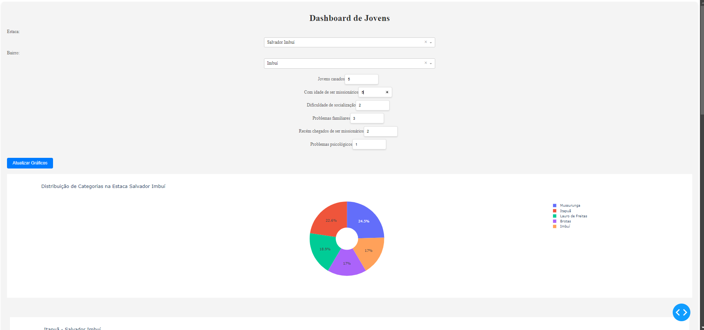
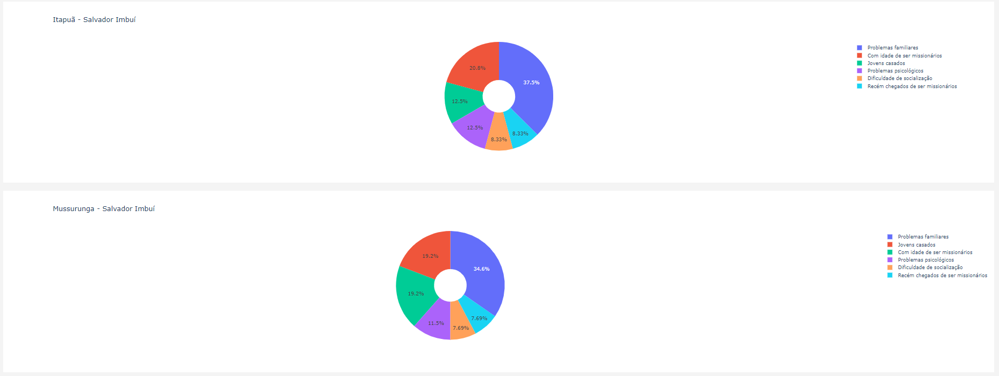

# Dashboard de Jovens

Este é um aplicativo Dash para visualizar e atualizar dados sobre jovens em diferentes bairros e estacas.

## Funcionalidades

- **Seleção de Estaca e Bairro**: Escolha uma estaca e um bairro para visualizar dados.
- **Inputs de Dados**: Insira valores em categorias específicas.
- **Atualização de Gráficos**: Atualize gráficos de distribuição com base nos dados inseridos.





## Tecnologias

- **Dash**: Framework para construir aplicações web interativas com Python.
- **Plotly Express**: Biblioteca para gráficos interativos.

## Pré-requisitos

Antes de executar o aplicativo, você precisa ter as seguintes ferramentas instaladas:

1. **Python**: [Download do Python](https://www.python.org/downloads/)
2. **Visual Studio Code (VSCode)**: [Download do VSCode](https://code.visualstudio.com/Download)

## Configuração do Ambiente

1. **Instale Python e VSCode**:
   - Baixe e instale o Python a partir do link acima.
   - Baixe e instale o Visual Studio Code a partir do link acima.

2. **Crie um Ambiente Virtual**:
    Abra o VSCode e, no terminal integrado, execute:
    ```bash
    python -m venv venv
    ```

3. **Ative o Ambiente Virtual**:
    - **No Windows**:
      ```bash
      .\venv\Scripts\activate
      ```
    - **No macOS/Linux**:
      ```bash
      source venv/bin/activate
      ```

4. **Instale as Dependências**:
    Com o ambiente virtual ativado, execute:
    ```bash
    pip install dash plotly
    ```

5. **Execute o Aplicativo**:
    No terminal do VSCode, execute:
    ```bash
    python app.py
    ```

6. **Acesse o Aplicativo no Navegador**:
   Vá para `http://127.0.0.1:8050/`.

## Contribuição

Sugestões e melhorias são bem-vindas. Abra uma issue ou envie um pull request.

## Licença

Licenciado sob a [MIT License](LICENSE).
